# RoPE
In this repository, I've explore the concept of Rotary Positional Embeddings, and how they integrate the strengths of both Absolute Positional Embeddings and Relative Positional Embeddings.

## Rotary Positional Embeddings (RoPE)
Rotary Positional Embeddings serve as a hybrid solution, capturing the advantages of both Absolute and Relative Positional Embeddings. Let's delve into a detailed understanding of this innovative approach:

Let us undertand the neccesity of incorporating the Positional Embeddings int he Transformers,

The reason we use Positional Embeddings is because Transformer models naturally don't consider the order of words in a sentence. For example, sentences like

- The Man escaped from the Snake
- The Snake escaped from the Man

could end up with the same representation in a Transformer, even though they mean different things.

This happens because Transformers treat all words as an unordered set. To keep track of the order of words and preserve their sequence, we introduce Positional Embeddings. These embeddings help the model understand and remember the position of each word in a sentence.

### Absolute Positional Embeddings

Let's say you have an Embedding that represents one word in a sentence, then to represent the positional information we have a vector of the same dimension as the word itself. So each one of these vectors represents one specific position in a sentence. For example, position 2 meaning a second word in a sentence, and each possible sentence Position will be represented by a different vector. 

In the process of creating the input for the Transformer Layer, we combine the word embedding with the positional embedding. There are two primary approaches for generating positional embeddings:

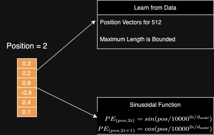

1) The initial method involves learning positional embeddings directly from the data, akin to other parameters in the model. This entails learning a distinct positional vector for each position, ranging from position one to the desired maximum length. However, a limitation arises in this method as it imposes a constraint on the maximum length representation. Learning positional vectors up to a certain position, for example, 512, restricts the ability to represent sequences longer than 512 tokens.

2) The alternative approach to obtaining positional embeddings employs a sinusoidal function. This method constructs a unique positional embedding for every possible position in the sequence. Unlike the first method, using sinusoidal functions allows flexibility in representing sequences of varying lengths.

In real-world scenarios, researchers have discovered that whether you learn positional embeddings from the data or construct them using sinusoidal functions, the performance of these methods is quite similar in actual machine learning models.

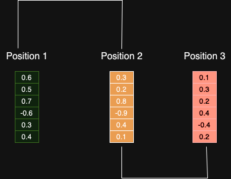

Another issue is that each positional embedding is essentially treated as independent of others. Consequently, there's no inherent distinction between Position 1 and Position 2 versus the relationship between Position 2 and Position 500. Intuitively, one would expect Position 1 and Position 2 to be more similar to each other than to Position 500, given their proximity in the sequence.

### Relative Positional Embeddings

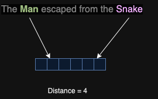

Another way to tackle this is through Relative Positional Embeddings. Instead of focusing on a token's absolute position in a sentence, this approach involves learning a representation for every pair of tokens. For instance, we find a way to represent two tokens that are a distance of 4 apart. Since the position varies for each pair of tokens, it's not as straightforward as just adding a Position Vector to the word Vector.

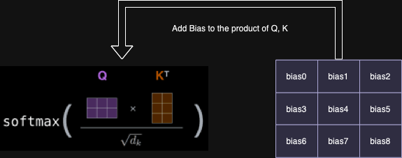

In a different approach, the attention mechanism is adjusted to incorporate relative positional embeddings. The bias, which signifies the distance between tokens, is introduced into the product of Query and Key matrices in the Self Attention layer. The benefit of this modification is that tokens separated by the same distance, let's say 4, will share the same bias, irrespective of their absolute positions in the sentence. Importantly, this method is scalable and can be applied to sequences of arbitrary length.

### Rotary Positional Embedding

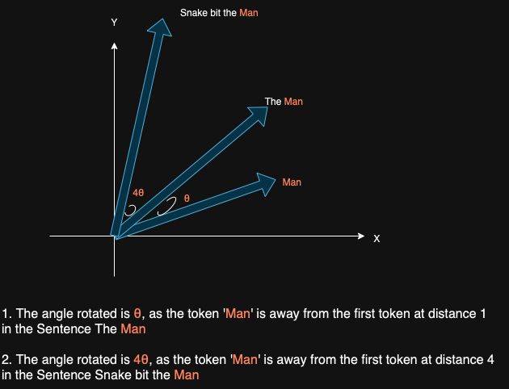

The main concept here is rather than adding a positional vector to indicate a word's position in a sentence, the proposed approach involves applying a rotation to the vector itself. To illustrate, consider a 2-dimensional word vector representing the word 'Man.' If this word appears in the second position in a sentence, the vector is rotated by an angle denoted as `θ`. For words occurring even later in the sentence, the vector undergoes additional rotation, and the degree of rotation is simply an integer multiple of the word's position in the sentence.

To depict the position `m` in a sentence, the original word vector is rotated by an angle of `m*θ`.

Rotary Positional Embedding brings several benefits over absolute positional embeddings. For instance, when adding more tokens to the end of a sentence, the vectors for the beginning of the sentence remain unchanged. This characteristic simplifies caching since, as long as a word occupies position number one in a sentence, its positional embedding remains unaffected regardless of the number of words following it.

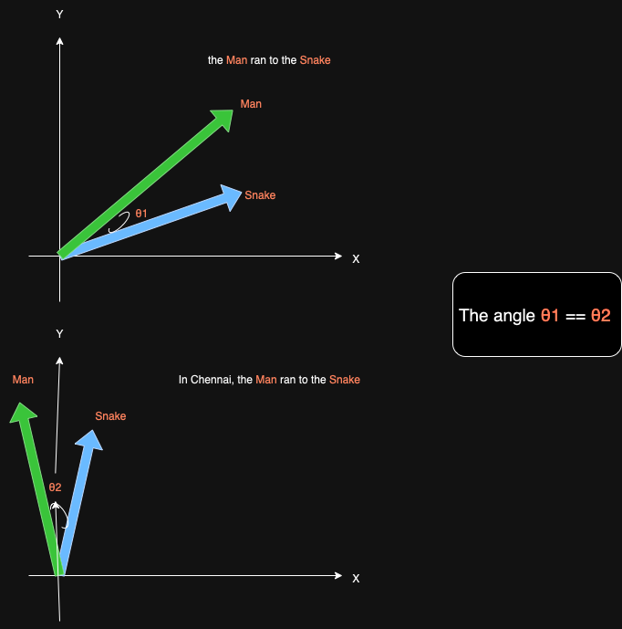

Another advantage is that it preserves the relative positions of words. Consider a sentence with 'Man' represented by a green vector and 'Snake' by a blue vector. If we add more words to the sentence while maintaining the distance between 'Man' and 'Snake,' the Rotary Positional Embeddings ensure that both vectors are rotated by the exact same amount. As a result, the angles between the vectors remain preserved. So, the dot product between the vectors stays constant when we add words to the beginning or end of the sentence, given that the distance between the two words remains unchanged. This observation highlights that Rotary Positional Embeddings encompass the advantages of both Absolute and Relative Positional Embeddings.

#### RoPE implementation: Matrix Multiplication

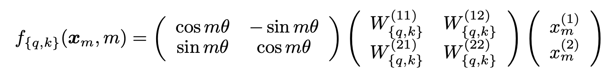

Here is the equation from the paper [ROFORMER: ENHANCED TRANSFORMER WITH ROTARY POSITION EMBEDDING](https://arxiv.org/pdf/2104.09864&hl=ja&sa=X&ei=5B0dZcHLGJ2h6rQPweSL0A0&scisig=AFWwaebUGjvb4JBysy2Z1l7aHWfJ&oi=scholarr) representing Rotary Embeddings for the 2D case.

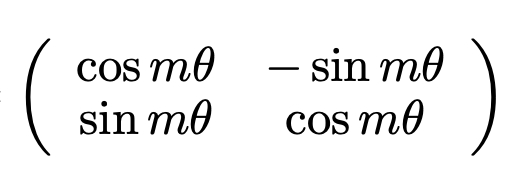

The crucial element here is a Rotation Matrix, and its purpose is to rotate a vector by an angle of `m*θ`, where `m` signifies the absolute position of the token in a sentence.

`x` is a vector, typically 2-dimensional in this case, that undergoes rotation. It's important to note that `Linear Transformations` are applied to obtain the `Query` and `Key` vectors before introducing the rotation matrix. This step ensures the preservation of rotational invariance property. The rotation is specifically applied to the `Query` and `Key` vectors, not to the `Value` vector in `self-attention`.

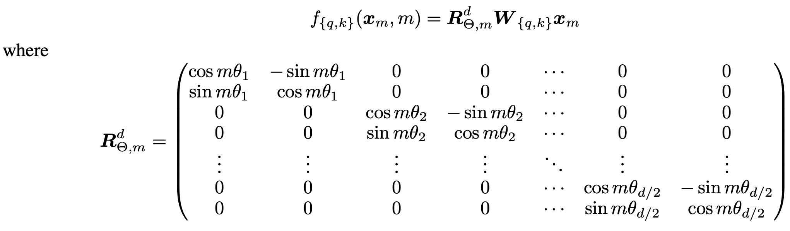

In a more general scenario, when the vector has more than two dimensions, the above equation comes into play. 

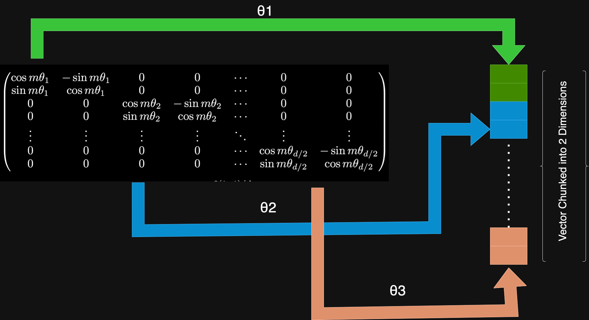

It essentially divides the vector into chunks of two dimensions each and performs rotations. The rotation process begins with applying a rotation to the first two dimensions of the vector, followed by a rotation to the next two dimensions, and so forth. Each pair of dimensions in the vector is subjected to a different rotation angle, denoted as `θ`. It's worth noting that the vector's dimension is assumed to be an even number, which is typically the case.

#### RoPE Actual Implementation

From the paper, the below equation is Computational efficient realization of Rotary Matrix Multiplication. This computation can be simplified using only two vector multiplications and one vector addition.

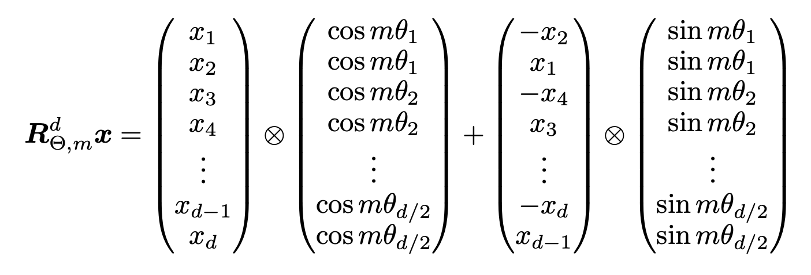

#### Long-term decay of RoPE

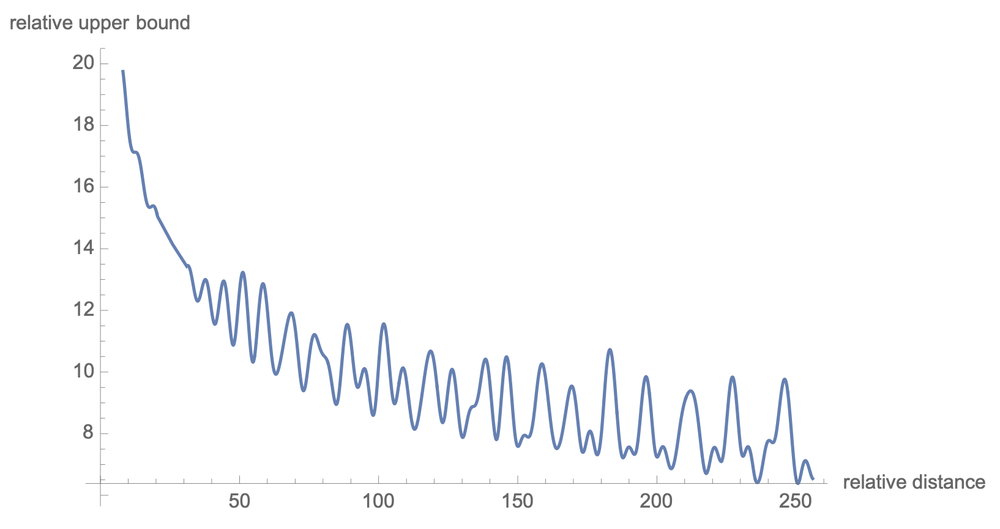

Another useful mathematical property lies behind the Rotary Positional Embeddings is that, when the words are close together then they are more likely to have a larger dot product. But when we've two words that are seperated by a lot of tokens apart, then they are expected to have a smaller dot product on an average. This is due to the way that the rotation is defined and intuitively it makes sense, because words that are far apart are less likely to have anything to do with each other.
